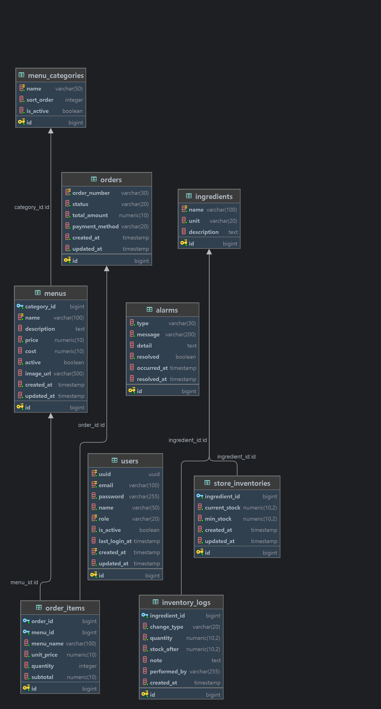

# 카페 운영 플랫폼

카페 매장 운영(주문·재고·메뉴)과 관리자용 대시보드를 마이크로서비스 아키텍처(MSA)로 구현한 풀스택 프로젝트입니다.
`api-gateway`, `auth-service`, `store-service`, `notification-service` 4개의 Spring Boot 백엔드 서비스와, 이를 사용하는 React 기반 관리자 웹앱 `cafe-admin`으로 구성되어 있습니다.

a- **배포 환경**: AWS EC2 단일 호스트 + Docker Compose, ECR, GitHub Actions OIDC 배포
- **도메인**: `cafe.beetledev.kr`(관리자 웹) / `gateway.beetledev.kr`(API)

| 서비스 | 저장소 | 역할 |
|---|---|---|
| api-gateway | [github.com/beetle-dev/api-gateway](https://github.com/beetle-dev/api-gateway) | 단일 진입점, JWT 인증/인가, 라우팅 |
| auth-service | [github.com/beetle-dev/auth-service](https://github.com/beetle-dev/auth-service) | 회원/인증, 토큰 발급·재발급 |
| store-service | [github.com/beetle-dev/store-service](https://github.com/beetle-dev/store-service) | 메뉴, 재고, 주문 도메인 |
| notification-service | [github.com/beetle-dev/notification-service](https://github.com/beetle-dev/notification-service) | 이벤트 기반 알림(Kafka, SSE, 이메일) |
| cafe-admin | [github.com/beetle-dev/cafe-admin](https://github.com/beetle-dev/cafe-admin) | 관리자 대시보드 (React) |

---

## 프로젝트를 만든 이유

>
> - 현업 MSA 프로젝트에서 API Gateway 없이 각 서비스가 인증·인가를 개별적으로 처리하는 구조를 경험했습니다. 이로 인해 인증 로직이 중복되고, 정책 변경 시 여러 서비스를 수정해야 하는 등 유지보수 비용이 증가하는 문제를 확인했습니다.<br>이러한 구조를 개선하기 위해 Spring Cloud Gateway를 도입하여 인증·인가를 중앙화한 MSA 프로젝트를 직접 설계하고 구현했습니다. 또한 Docker Compose, Nginx, GitHub Actions OIDC를 활용해 실제 운영 환경과 유사한 배포 및 서비스 운영 환경을 구축하며 MSA 아키텍처를 경험하고자 했습니다. 
> - 백오피스에서는 사용자에게 실시간으로 이벤트를 전달하는 기능이 중요하다고 생각합니다. 이에 주문 완료와 같은 이벤트를 비동기적으로 처리하기 위해 Kafka를 도입하고, 이를 기반으로 SSE(Server-Sent Events) 알림 기능을 구현했습니다.
> - 현업 백오피스 서비스에서는 자주 조회되는 데이터의 응답 속도가 느려 업무 효율이 저하되는 문제가 있었습니다. 이를 개선하기 위해 변경 빈도가 낮은 데이터를 Redis 캐시에 저장하여 조회 성능을 향상시켰습니다.

---

## 시스템 아키텍처

```
                         ┌─────────────────┐
                         │   cafe-admin     │  React 관리자 웹
                         │ (Vite + TS)      │
                         └────────┬─────────┘
                                  │ HTTPS
                                  ▼
                         ┌─────────────────┐
                         │   api-gateway    │  Spring Cloud Gateway (WebFlux)
                         │  JWT 검증 · CORS  │  - Path 기반 라우팅
                         │  라우팅 · 헤더 전파 │  - X-User-Id / X-User-Role 주입
                         └───┬─────┬─────┬──┘  - X-Gateway-Secret 로 내부망 신뢰 경계 구성
                             │     │     │
              /login,/auth/**│     │/stores/**,/menus/**  │/notification/**,/alarms/**
                             ▼     ▼                       ▼
                    ┌────────────┐ ┌────────────┐  ┌───────────────────┐
                    │auth-service│ │store-service│  │notification-service│
                    │ 회원/인증   │ │ 메뉴/재고/주문│  │ 알림 소비 · SSE ·이메일│
                    └─────┬──────┘ └──────┬──────┘  └─────────┬──────────┘
                          │               │  Kafka(alarm-events) 발행
                          │               └───────────────────►│ 구독(consumer group)
                          │
                    PostgreSQL / Redis (서비스별 스키마·키스페이스 분리)
```

> 
> JWT 검증은 `api-gateway`에서 단 한 번만 수행합니다.<br>게이트웨이가 토큰을 파싱해 `X-User-Id`, `X-User-Role` 헤더로 변환하고, 내부 서비스에는 `X-Gateway-Secret` 공유 비밀 헤더를 함께 실어 보냅니다. 각 내부 서비스(`auth`, `store`, `notification`)는 Spring Security 인가를 사실상 전면 허용(`permitAll`)해 두고, 대신 `GatewayAuthFilter`로 "게이트웨이를 거쳐 온 요청인지"만 검증합니다. 즉 토큰 재검증 없이 헤더 기반으로 신원을 신뢰하는 구조이며, 이를 통해 각 서비스는 인증 로직 없이 비즈니스 로직에만 집중할 수 있습니다.

---

## 기술 스택

| 구분 | 내용                                                                                                |
|---|---------------------------------------------------------------------------------------------------|
| Language / Runtime | Java 17, TypeScript                                                                               |
| Backend Framework | Spring Boot 3.5.13, Spring Cloud Gateway(WebFlux), Spring Security, Spring Data JPA, Spring Kafka |
| Frontend Framework | React 19, Vite, React Router, Zustand, TailwindCSS, Chart.js, React Hook Form                     |
| Database / Cache | PostgreSQL 18.3, Redis 7                                                                          |
| Messaging | Apache Kafka
| 인증 | JWT, Redis 기반 RefreshToken/Blacklist 관리                                         |
| 인프라 / 스토리지 | AWS EC2, ECR, S3(메뉴 이미지, Presigned URL), Secrets Manager                                          |
| CI/CD | GitHub Actions (OIDC 기반 AWS 인증) → Docker 빌드/ECR Push → SSH 배포 → Docker Compose 단일 서비스 무중단 교체      |
| 컨테이너 | Docker, Docker Compose (단일 EC2 호스트에서 5개 컨테이너 운영)                                                  |

---

## 서비스별 상세

### 1. api-gateway — 단일 진입점

- WebFlux 기반 리액티브 게이트웨이로, 비즈니스 로직 없이 인증/라우팅/에러 표준화만 담당합니다.
- `JwtAuthGlobalFilter`(`GlobalFilter`, order=-1)에서 `Authorization: Bearer` 토큰을 파싱하고, `jti`를 이용해 Redis 블랙리스트(`blacklist:{jti}`) 존재 여부를 조회해 로그아웃된 토큰을 즉시 차단합니다.
- 인증이 필요 없는 경로(`/login`, `/auth/signup`, `/auth/reissue`, `/alarms/subscribe`)도 예외 없이 `X-Gateway-Secret`을 주입해, 비로그인 요청도 게이트웨이를 통과했음을 내부 서비스가 검증할 수 있게 합니다.
- 라우팅은 `lb://` 서비스 디스커버리 없이 정적 URL/환경 변수(`CLOUD_GATEWAY_AUTH` 등)로 구성 — Eureka/Consul 없는 단순 Docker Compose 배포에 맞춘 선택입니다.
- CORS는 게이트웨이에서 단일 지점으로 관리(운영: `cafe.beetledev.kr` 오리진만 허용).

### 2. auth-service — 인증/회원 관리

- `POST /login`은 컨트롤러가 아닌 `LoginFilter`(`UsernamePasswordAuthenticationFilter` 커스텀 구현)로 처리, 성공 시 AccessToken은 응답 바디로, RefreshToken은 HttpOnly 쿠키로 내려줍니다.
- AccessToken(1시간) / RefreshToken(30일) 이중 토큰 구조. RefreshToken은 DB가 아닌 Redis(`@RedisHash`)에 저장해 재발급/강제 만료를 빠르게 처리합니다.
- 로그아웃 시 AccessToken을 `jti` 기준으로 Redis에 블랙리스트 등록(만료 시각까지만 TTL 유지 → 자동 정리).
- 회원가입은 `PENDING` 상태로 생성되고, 관리자가 승인/역할 부여를 해야 로그인 가능 — 매장 직원 온보딩 승인 플로우를 반영한 설계입니다.
- UUID를 외부 식별자로, DB PK(Long)는 내부용으로 분리해 시퀀셜 ID 노출을 방지했습니다.

### 3. store-service — 메뉴 · 재고 · 주문 도메인

- `/menus`, `/stores/inventory`, `/stores/orders` 세 축의 CRUD/조회 API를 제공합니다.
- 메뉴 이미지는 S3에 업로드하고 Presigned URL로 응답 — DB 저장 실패 시 업로드된 S3 객체를 보상 삭제하는 로직을 포함합니다.
- 주문 생성 시 `OrderItem`에 메뉴명/단가/소계를 스냅샷(비정규화)으로 저장해, 이후 메뉴 정보가 바뀌어도 과거 주문 내역이 변하지 않도록 합니다.
- 재고 부족/주문 발생 이벤트는 `ApplicationEventPublisher` + `@TransactionalEventListener(AFTER_COMMIT)`으로 받아 트랜잭션 커밋 이후에만 Kafka(`alarm-events`)로 발행 — DB 반영 전에 알림이 먼저 나가는 정합성 문제를 방지합니다.
- Redis로 메뉴/카테고리 목록을 캐싱(TTL 5~10분)해 조회 성능을 개선했습니다.

### 4. notification-service — 이벤트 기반 알림

- Kafka `alarm-events` 토픽을 구독(`@KafkaListener`, group: `notification-service`)해 알림을 저장하고, 실패 메시지는 3회 재시도 후 Dead Letter Topic으로 격리합니다.
- **DB 저장 성공 후에만 Kafka offset을 커밋**하는 수동 ACK(`MANUAL_IMMEDIATE`) 방식으로 메시지 유실을 방지했습니다.
- 관리자 화면에는 Server-Sent Events(SSE)로 실시간 알림을 push — WebSocket 대신 단방향 스트리밍만 필요한 요구사항에 맞춰 더 가벼운 방식을 선택했습니다.
- 이메일 발송은 `@Async` 전용 스레드풀에서 처리해 Kafka 리스너 스레드가 SMTP 지연에 영향받지 않도록 분리했습니다.

### 5. cafe-admin — 관리자 대시보드 (React)

> ⚠️ **본 서비스(cafe-admin)의 프론트엔드 코드는 Claude(Anthropic)를 활용해 전체 구현했습니다.**<br>직접 타이핑한 코드가 아니라, 요구사항 정의·API 연동 설계·리뷰를 담당하고 실제 구현은 AI에게 위임한 결과물임을 명확히 밝힙니다.

---

## 데이터베이스 ERD
3개의 마이크로서비스가 하나의 데이터베이스를 공유합니다.


---

## CI/CD & 배포

4개 백엔드 서비스 모두 동일한 파이프라인 구조를 사용합니다.

1. `master` 브랜치 push 시 GitHub Actions 트리거
2. `./gradlew build -x test` 로 빌드 (Java 17 / Temurin)
3. GitHub OIDC로 AWS 역할을 임시 assume (장기 액세스 키 미사용)
4. Docker 이미지 빌드 → ECR push 
5. SSH로 운영 EC2 접속 → 이미지 pull → 해당 서비스 컨테이너만 `docker-compose up -d --no-deps <service>` 로 무중단 교체 (다른 서비스는 그대로 유지)

인프라 공통 요소(`docker-compose.yml`)로 PostgreSQL, Redis, Kafka를 함께 구동합니다.

---

## 회고 / 개선 포인트


- **테스트 코드 부재**: 4개 서비스 모두 테스트 의존성은 추가했지만 실제 테스트 코드는 작성하지 않았고, CI에서도 `-x test` 옵션으로 테스트를 제외했습니다. 다음 단계에서는 테스트 코드를 추가하고, CI에서도 테스트를 수행하도록 개선하고 싶습니다.

- **배포 환경 단순화**: 초기에는 ECS 기반 배포를 구성했지만, 프로젝트 규모에 비해 운영 비용이 예상보다 크게 발생했습니다. 비용과 운영 효율을 고려해 현재는 단일 EC2 + Docker Compose 환경으로 전환했습니다. 이후에는 필요에 따라 ECS 또는 Kubernetes 환경으로 확장 가능한 구조를 다시 구성해 보고 싶습니다.

- **Git 브랜치 전략 및 커밋 관리 미흡**: 개인 프로젝트라는 이유로 기능 브랜치 없이 작업하거나 커밋 메시지가 일관되지 않은 부분이 있었습니다. 이후에는 Git Flow 또는 GitHub Flow 기반으로 브랜치를 운영하고, Conventional Commits 규칙을 적용하여 변경 이력을 체계적으로 관리하고 싶습니다.

- **프론트엔드 구현 경험 부족**: React 경험이 많지 않아 관리자 페이지는 AI의 도움을 적극 활용하여 구현했습니다. 다만 요구사항 정의, 기능 검토는 직접 수행했으며, 앞으로는 React와 상태 관리에 대한 이해를 높여 프론트엔드 구현 역량도 강화하고 싶습니다.

- **API 명세 관리 부재**: 현재는 별도의 API 문서를 제공하지 않아 서비스 간 인터페이스를 코드로 확인해야 하는 불편함이 있습니다. SpringDoc(OpenAPI)와 Swagger UI를 적용하여 API 명세를 자동화하고, 협업 및 유지보수성을 개선하고 싶습니다.

- **통합 로깅 환경 부재**: 각 서비스의 로그는 개별적으로 확인할 수 있지만, 서비스 간 요청 흐름을 한 번에 추적하기는 어렵습니다. 추후에는 Kibana) 또는 Grafana Loki 기반의 중앙 집중식 로그 수집 환경을 구축하여 장애 분석과 모니터링을 개선하고 싶습니다.
